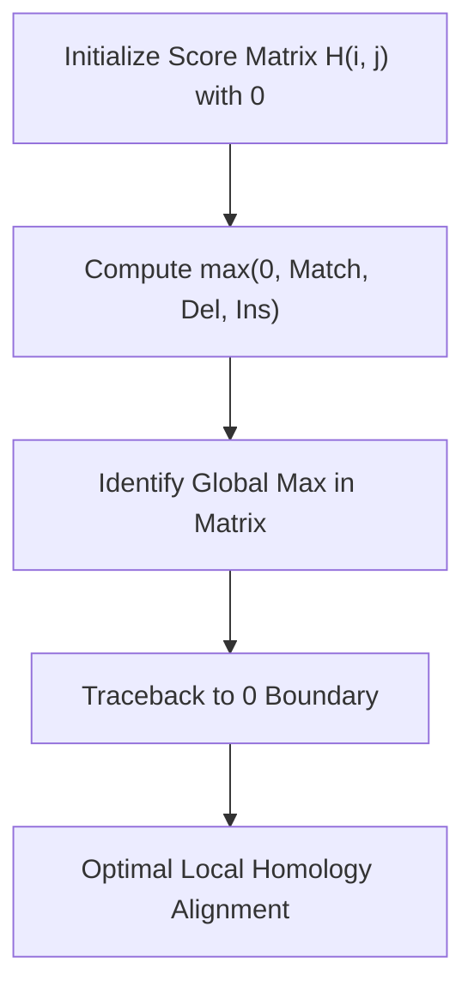

# Smith-Waterman Local Sequence Alignment Skill

Dynamic programming algorithm for optimal local sequence alignment between biological sequences.

## Features
- **100% Python Standard Library**: No external dependencies.
- **Customizable Scoring**: Configurable match reward, mismatch, and linear gap penalties.
- **MCP Server Ready**: Direct stdio integration for computational genomics.
